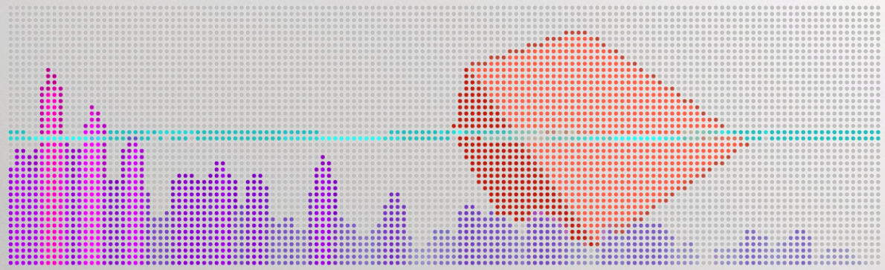

## Getting Started

1. Install the [previewer](https://github.com/googlecreativelab/anypixel/blob/master/frontend/previewer/README.md)
	- *See the [previewer documentation](https://github.com/googlecreativelab/anypixel/tree/master/frontend/previewer) repository for more information about using the previewer tool.*

2. `npm install`

3. `npm run build && previewer`

Anypixel works by injecting your app into a template HTML page which communicates with the button wall. Only one .js file is injected; if you're using multiple .js files, we recommend bundling them together. In the example app, we use [Browserify](browserify.org) to do this.
